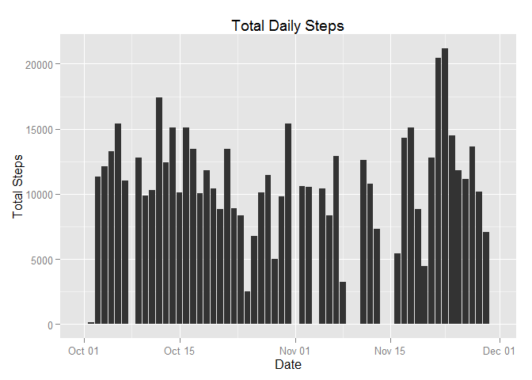
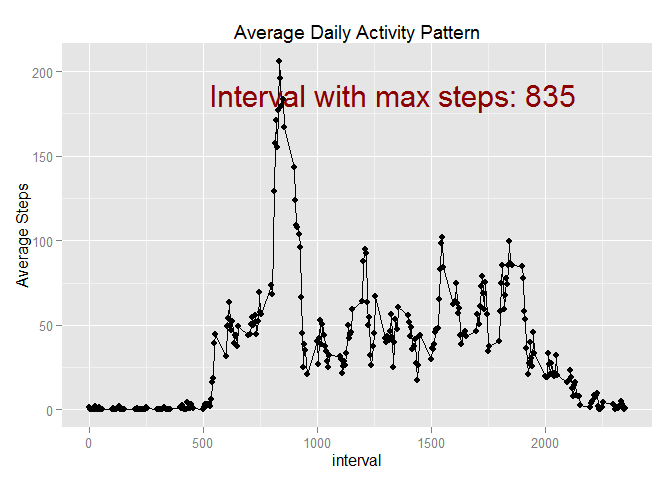
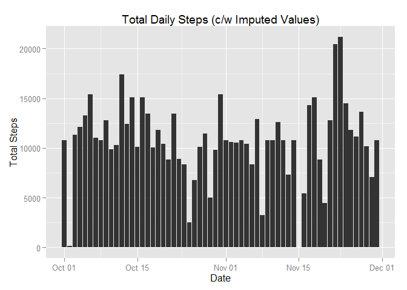
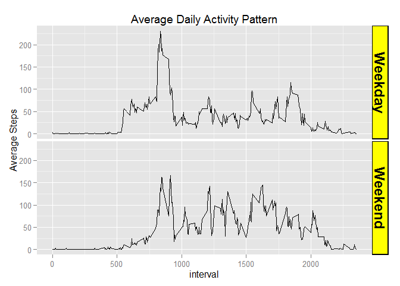

# Reproducible Research: Peer Assessment 1


## Loading and preprocessing the data
1. If zip file exists, unzip it and overwrite any previously unzipped file.   
2. Read the data into dataframe activity
3. Rename variable date to dateFactor and add extra variable date derived from dateFactor as date class
4. Create new variable Id which serves as a unique identifier for each row.This will be concatenation of dateFactor and interval.


```r
if (file.exists("activity.zip")) {
	unzip("activity.zip", overwrite=TRUE)
}
activity <- read.csv("activity.csv")
names(activity) [names(activity) == "date"] <- c("dateFactor")
activity$date <- as.Date(as.character(activity$dateFactor), "%Y-%m-%d")
#activity$Id <- paste(activity$dateFactor, activity$interval, sep=":")
##activity$timeStr <- paste("000", as.character(activity$interval), sep="")
##activity$time <- substr(activity$timeStr, nchar(activity$timeStr) - 3, nchar(activity$timeStr))
```

## What is mean total number of steps taken per day?
1. Use the ddply function to calculate the mean number of steps per day.
2. Use the ddply function to calculate the median number of steps per day.
3. Use the ddply function to calculate the total number of steps per day.

```r
library(plyr)
```

```
## Warning: package 'plyr' was built under R version 3.2.3
```

```r
meanPerDay <- ddply(activity, "date", summarise, MeanSteps=mean(steps, na.rm=TRUE))
medianPerDay <- ddply(activity, "date", summarise, MedianSteps=median(steps, na.rm=TRUE))
totalPerDay <- ddply(activity, "date", summarise, TotalSteps=sum(steps, na.rm=TRUE))
```
5. Join the three resulting data frames together into one dataframe named data

```r
data <- meanPerDay
data <- merge(data, medianPerDay, by="date")
data <- merge(data, totalPerDay, by="date")
```
6. Using library ggplot2, plot histogram of total steps per day.

```r
library(ggplot2)
ggplot(data, aes(x=date, y=TotalSteps)) + geom_bar(stat="identity") + xlab("Date") + ylab("Total Steps") + ggtitle("Total Daily Steps")
```

 

7. Display median and mean number of steps per day

```r
data[, c("date", "MeanSteps", "MedianSteps")]
```

```
##          date  MeanSteps MedianSteps
## 1  2012-10-01        NaN          NA
## 2  2012-10-02  0.4375000           0
## 3  2012-10-03 39.4166667           0
## 4  2012-10-04 42.0694444           0
## 5  2012-10-05 46.1597222           0
## 6  2012-10-06 53.5416667           0
## 7  2012-10-07 38.2465278           0
## 8  2012-10-08        NaN          NA
## 9  2012-10-09 44.4826389           0
## 10 2012-10-10 34.3750000           0
## 11 2012-10-11 35.7777778           0
## 12 2012-10-12 60.3541667           0
## 13 2012-10-13 43.1458333           0
## 14 2012-10-14 52.4236111           0
## 15 2012-10-15 35.2048611           0
## 16 2012-10-16 52.3750000           0
## 17 2012-10-17 46.7083333           0
## 18 2012-10-18 34.9166667           0
## 19 2012-10-19 41.0729167           0
## 20 2012-10-20 36.0937500           0
## 21 2012-10-21 30.6284722           0
## 22 2012-10-22 46.7361111           0
## 23 2012-10-23 30.9652778           0
## 24 2012-10-24 29.0104167           0
## 25 2012-10-25  8.6527778           0
## 26 2012-10-26 23.5347222           0
## 27 2012-10-27 35.1354167           0
## 28 2012-10-28 39.7847222           0
## 29 2012-10-29 17.4236111           0
## 30 2012-10-30 34.0937500           0
## 31 2012-10-31 53.5208333           0
## 32 2012-11-01        NaN          NA
## 33 2012-11-02 36.8055556           0
## 34 2012-11-03 36.7048611           0
## 35 2012-11-04        NaN          NA
## 36 2012-11-05 36.2465278           0
## 37 2012-11-06 28.9375000           0
## 38 2012-11-07 44.7326389           0
## 39 2012-11-08 11.1770833           0
## 40 2012-11-09        NaN          NA
## 41 2012-11-10        NaN          NA
## 42 2012-11-11 43.7777778           0
## 43 2012-11-12 37.3784722           0
## 44 2012-11-13 25.4722222           0
## 45 2012-11-14        NaN          NA
## 46 2012-11-15  0.1423611           0
## 47 2012-11-16 18.8923611           0
## 48 2012-11-17 49.7881944           0
## 49 2012-11-18 52.4652778           0
## 50 2012-11-19 30.6979167           0
## 51 2012-11-20 15.5277778           0
## 52 2012-11-21 44.3993056           0
## 53 2012-11-22 70.9270833           0
## 54 2012-11-23 73.5902778           0
## 55 2012-11-24 50.2708333           0
## 56 2012-11-25 41.0902778           0
## 57 2012-11-26 38.7569444           0
## 58 2012-11-27 47.3819444           0
## 59 2012-11-28 35.3576389           0
## 60 2012-11-29 24.4687500           0
## 61 2012-11-30        NaN          NA
```
## What is the average daily activity pattern?
1. Create a subset called timeSeries containing average number of steps per time period.
2. From timeSeries, calculate maxSteps, which stores the value of greatest average steps.
2. From timeSeries, calculate maxInterval, which stores the interval with greatest average steps.
3. Plot a line chart to observe the average daily activity pattern.
4. In the same plot, annotate to show the interval calculated and stored in maxInterval

```r
timeSeries <- ddply(activity, "interval", summarise, avg=mean(steps, na.rm=TRUE))
maxSteps <- max(timeSeries$avg, na.rm=TRUE)
maxInterval <- timeSeries[timeSeries$avg==maxSteps, c("interval")]
ggplot(timeSeries, aes(x=interval, y=avg)) + geom_line() + geom_point() + ylab("Average Steps") + ggtitle("Average Daily Activity Pattern") + annotate("text", x=maxInterval+500, y=maxSteps-20, label=paste("Interval with max steps:", maxInterval, sep=" "), colour="darkred", size=8)
```

 

## Imputing missing values
1. Report on rows with missing values

```r
apply(is.na(activity),2, FUN=sum)
```

```
##      steps dateFactor   interval       date 
##       2304          0          0          0
```
2. Create 2 dataframes subsetting activity. One with NA steps, and the other where steps has a value

```r
nullRows <- activity[is.na(activity$steps), ]
completeData <- activity[!is.na(activity$steps), ]
```
3. Remove steps variable from nullRows and add average steps for that time period from timeSeries, renaming variable avg to steps

```r
nullRows <- subset(nullRows, select=-steps)
nullRows <- merge(nullRows, timeSeries, by="interval")
names(nullRows) [names(nullRows) == "avg"] <- c("steps")
```
4. Reorder the variables of nullRows to match variables in completeData
5. Add nullRows (now with imputed values of steps) to completeData

```r
nullRows <- nullRows[c("steps", "interval", "dateFactor", "date")]
completeData <- rbind(completeData, nullRows)
```
6. Calculate total, mean and median for steps per day, including the imputed values

```r
newTotalPerDay <- ddply(completeData, "date", summarise, TotalSteps=sum(steps, na.rm=TRUE))
newMeanPerDay <- ddply(completeData, "date", summarise, MeanSteps=mean(steps, na.rm=TRUE))
newMedianPerDay <- ddply(completeData, "date", summarise, MedianSteps=median(steps, na.rm=TRUE))
```
7. Merge these new dataframes into one dataframe, for ease of analysing/reporting.

```r
newData <- newMeanPerDay
newData <- merge(newData, newMedianPerDay, by="date")
newData <- merge(newData, newTotalPerDay, by="date")
```
8. From the newly merged dataframe plot Total Steps for each day

```r
ggplot(newData, aes(x=date, y=TotalSteps)) + geom_bar(stat="identity") + xlab("Date") + ylab("Total Steps") + ggtitle("Total Daily Steps (c/w Imputed Values)")
```

 
9. Display median and mean number of steps per day with imputed values

```r
newData[, c("date", "MeanSteps", "MedianSteps")]
```

```
##          date  MeanSteps MedianSteps
## 1  2012-10-01 37.3825996    34.11321
## 2  2012-10-02  0.4375000     0.00000
## 3  2012-10-03 39.4166667     0.00000
## 4  2012-10-04 42.0694444     0.00000
## 5  2012-10-05 46.1597222     0.00000
## 6  2012-10-06 53.5416667     0.00000
## 7  2012-10-07 38.2465278     0.00000
## 8  2012-10-08 37.3825996    34.11321
## 9  2012-10-09 44.4826389     0.00000
## 10 2012-10-10 34.3750000     0.00000
## 11 2012-10-11 35.7777778     0.00000
## 12 2012-10-12 60.3541667     0.00000
## 13 2012-10-13 43.1458333     0.00000
## 14 2012-10-14 52.4236111     0.00000
## 15 2012-10-15 35.2048611     0.00000
## 16 2012-10-16 52.3750000     0.00000
## 17 2012-10-17 46.7083333     0.00000
## 18 2012-10-18 34.9166667     0.00000
## 19 2012-10-19 41.0729167     0.00000
## 20 2012-10-20 36.0937500     0.00000
## 21 2012-10-21 30.6284722     0.00000
## 22 2012-10-22 46.7361111     0.00000
## 23 2012-10-23 30.9652778     0.00000
## 24 2012-10-24 29.0104167     0.00000
## 25 2012-10-25  8.6527778     0.00000
## 26 2012-10-26 23.5347222     0.00000
## 27 2012-10-27 35.1354167     0.00000
## 28 2012-10-28 39.7847222     0.00000
## 29 2012-10-29 17.4236111     0.00000
## 30 2012-10-30 34.0937500     0.00000
## 31 2012-10-31 53.5208333     0.00000
## 32 2012-11-01 37.3825996    34.11321
## 33 2012-11-02 36.8055556     0.00000
## 34 2012-11-03 36.7048611     0.00000
## 35 2012-11-04 37.3825996    34.11321
## 36 2012-11-05 36.2465278     0.00000
## 37 2012-11-06 28.9375000     0.00000
## 38 2012-11-07 44.7326389     0.00000
## 39 2012-11-08 11.1770833     0.00000
## 40 2012-11-09 37.3825996    34.11321
## 41 2012-11-10 37.3825996    34.11321
## 42 2012-11-11 43.7777778     0.00000
## 43 2012-11-12 37.3784722     0.00000
## 44 2012-11-13 25.4722222     0.00000
## 45 2012-11-14 37.3825996    34.11321
## 46 2012-11-15  0.1423611     0.00000
## 47 2012-11-16 18.8923611     0.00000
## 48 2012-11-17 49.7881944     0.00000
## 49 2012-11-18 52.4652778     0.00000
## 50 2012-11-19 30.6979167     0.00000
## 51 2012-11-20 15.5277778     0.00000
## 52 2012-11-21 44.3993056     0.00000
## 53 2012-11-22 70.9270833     0.00000
## 54 2012-11-23 73.5902778     0.00000
## 55 2012-11-24 50.2708333     0.00000
## 56 2012-11-25 41.0902778     0.00000
## 57 2012-11-26 38.7569444     0.00000
## 58 2012-11-27 47.3819444     0.00000
## 59 2012-11-28 35.3576389     0.00000
## 60 2012-11-29 24.4687500     0.00000
## 61 2012-11-30 37.3825996    34.11321
```
Observing comparisons between the original data and the data with imputed values:   
1. Mean values for days with NA now have a mean value. Days with existing non-NA values haven't changed as we replace NA values with the mean for that time period.   
2. Median values for each day now has a value.   
3. Totals now enables a plot with no missing values   
## Are there differences in activity patterns between weekdays and weekends?
1. Create a new variable of class factor, with labels of weekday and weekend depending on the day of week in date variable

```r
weekdays <- c("Monday", "Tuesday", "Wednesday", "Thursday", "Friday")
completeData$weekday <- factor((weekdays(completeData$date) %in% weekdays), levels=c(TRUE, FALSE), labels=c("Weekday", "Weekend"))
```
2. Create a new dataframe of averaged number of steps per weekday/weekend and per interval

```r
newTimeSeries <- ddply(completeData, c("interval", "weekday"), summarise, avg=mean(steps, na.rm=TRUE))
```
3. Display a panel plot of average number of steps per interval for each of weekday and weekend.

```r
ggplot(newTimeSeries, aes(x=interval, y=avg)) + geom_line() + ylab("Average Steps") + ggtitle("Average Daily Activity Pattern") + facet_grid(weekday ~. ) + theme(strip.text = element_text(face="bold", size=rel(1.5)), strip.background = element_rect(fill="yellow", colour="black", size=1))
```

 
